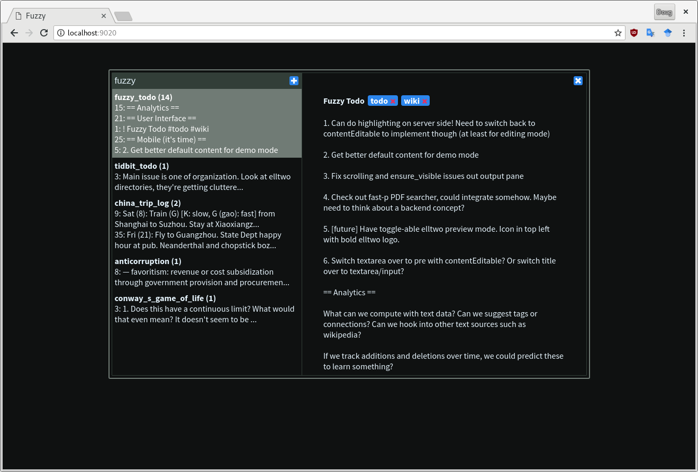

# Fuzzy

High performance note taking with fuzzy search. Powered by [fzf](https://github.com/junegunn/fzf) and Python.



# Installing

First install [fzf](https://github.com/junegunn/fzf) and [the silver searcher (ag)](https://github.com/ggreer/the_silver_searcher) and  make sure they're in your path. The only non-standard Python package requirement is `tornado`. Finally, clone this repository locally.

To enable highlighting, you need to use a custom `fzf` locally. First install `make` and `go`, then run
```
git submodule init
git submodule update
make -C fzf install
```

# Running

To use Fuzzy in editing mode, run the command
```
python3 server.py --path=PATH --edit
```
where PATH is the directory in which your notes will be read from and stored (it should exist and can be non-empty). Head on over to `http://localhost:9020` to use.

The above will only be available locally. Add `--ip=0.0.0.0` to the command for non-local use. You can also specify which port to use with the `--port=PORT` option. For read-only mode, simply omit the `--edit` flag.

# Interface

You can do everthing from the keyboard, but the mouse still works if you like. When you're in the search pane, typing will modify your query then press `Enter` to run it and `Up`/`Down` to navigate the results. As you move through the results, the note contents will be displayed in the view pane. Press `Tab` to switch between the view pane and the search pane. When in the view pane, you also have

- `Shift + Enter`: Save the note to disk. When you do this the box in the top right will turn from red (edited) to blue (saved/unmodified).
- `Ctrl + Enter`: Add a tag to the current note. This will create an empty tag which you must type in then press `Enter` again to commit it.
